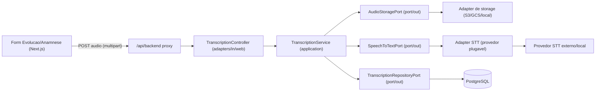
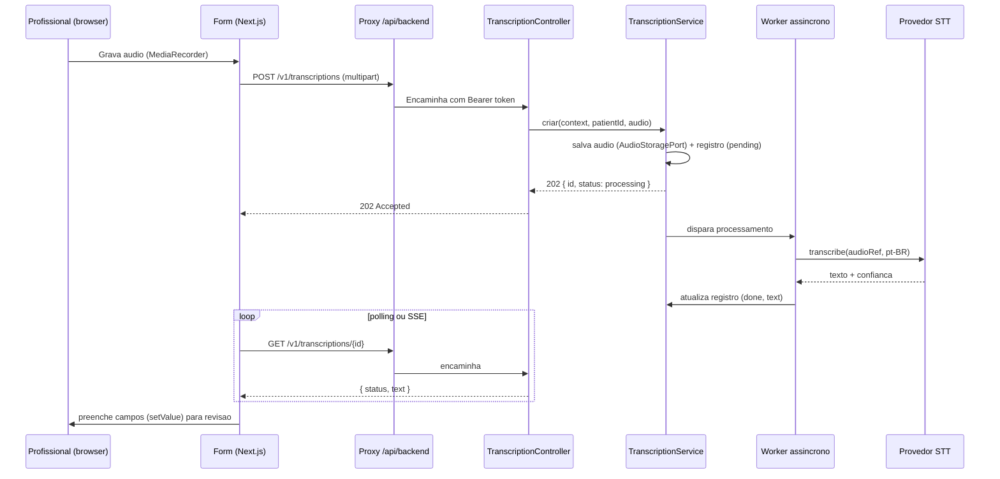

# Funcionalidade de Transcrição de Áudio (Especificação-base para API)

> Status: proposta / documento de referência para construção da API.
> Última atualização: 2026-07-07.

Este documento descreve o contrato e a arquitetura de uma futura funcionalidade de
**transcrição de áudio** (speech-to-text) para o Super Sistema Julli Severina. A transcrição
será usada para acelerar o preenchimento de **Evolução** e **Anamnese**, permitindo que o
profissional dite o atendimento e receba o texto pronto para revisão.

O design é **agnóstico de provedor**: o contrato da API e o domínio não dependem de nenhum
serviço específico (OpenAI Whisper, Google Speech-to-Text, Whisper self-hosted, etc.). A troca
de provedor deve ser uma questão de configuração/adapter, sem impacto no restante do sistema.

---

## 1. Objetivo e casos de uso

- **Evolução**: ditar a sessão e preencher os campos textuais `objetivosSessao`,
  `atividadesRealizadas`, `respostaPaciente` e `observacoes`.
- **Anamnese**: ditar a anamnese e preencher o bloco único `anamneseTexto` (HTML).

O fluxo padrão é: o profissional grava o áudio no navegador, o áudio é enviado ao backend, a
transcrição é processada de forma **assíncrona** e o texto retornado é inserido no formulário
(via React Hook Form `setValue`) para **revisão humana obrigatória** antes de salvar.

Princípio clínico: a transcrição é um **rascunho assistido**. O texto final é sempre validado
pelo profissional; nada é persistido no prontuário sem confirmação.

---

## 2. Arquitetura (Ports & Adapters / Hexagonal)

Seguindo o padrão já usado no orquestrador (`msorquestrador-jf`), a transcrição entra como um
novo caso de uso na camada `application`, com uma **porta de saída** que abstrai o provedor STT
e uma **porta de saída** para armazenamento do áudio.



Componentes propostos (nomes sugeridos, seguindo a convenção do projeto):

| Camada | Elemento | Responsabilidade |
|---|---|---|
| `domain/transcription` | `Transcription` (record), `TranscriptionStatus` (enum) | Modelo puro, sem framework |
| `application` | `TranscriptionService` | Orquestra upload, disparo assíncrono, consulta |
| `application/port/out` | `SpeechToTextPort` | Contrato de transcrição (áudio -> texto), agnóstico |
| `application/port/out` | `AudioStoragePort` | Persistência do arquivo de áudio (URL pré-assinada) |
| `application/port/out` | `TranscriptionRepositoryPort` | Persistência do registro/estado da transcrição |
| `adapters/in/web/api` | `TranscriptionController` | Endpoints REST `/v1/transcriptions` |
| `adapters/out/stt` | `*SpeechToTextAdapter` | Implementação por provedor (plugável por env) |
| `adapters/out/storage` | `*AudioStorageAdapter` | Implementação de storage |

O **domínio não conhece o provedor**. Adicionar um novo provedor = criar um novo adapter que
implementa `SpeechToTextPort` e selecioná-lo por configuração.

### Contrato conceitual da porta STT

```java
public interface SpeechToTextPort {
    // Recebe referência ao áudio + metadados e devolve o texto (ou lança erro de transcrição).
    TranscriptionResult transcribe(TranscriptionInput input);

    record TranscriptionInput(
        String audioRef,      // URL/objeto do áudio no storage
        String languageHint,  // ex.: "pt-BR"
        String mimeType,      // ex.: "audio/webm"
        String context        // "evolucao" | "anamnese" (para prompts/formatação)
    ) {}

    record TranscriptionResult(
        String text,
        Double confidence,    // opcional (0..1)
        Integer durationSec   // opcional
    ) {}
}
```

---

## 3. Contrato da API REST

Base: `/v1/transcriptions` (autenticação JWT Bearer via cookies HttpOnly, igual aos demais
endpoints; multi-tenant por `clinicId` do `FisioPrincipal`).

### 3.1. Criar transcrição (upload de áudio)

`POST /v1/transcriptions` — `Content-Type: multipart/form-data`

Campos do formulário:

| Campo | Tipo | Obrigatório | Descrição |
|---|---|---|---|
| `audio` | file | sim | Arquivo de áudio (ver formatos e limites) |
| `context` | string | sim | `evolucao` ou `anamnese` |
| `patientId` | number | não | Vincula ao paciente (auditoria/LGPD) |
| `language` | string | não | Padrão `pt-BR` |

Resposta `202 Accepted` (processamento assíncrono):

```json
{
  "id": "b1d2...",
  "status": "processing",
  "context": "evolucao",
  "createdAt": "2026-07-07T22:40:00Z"
}
```

### 3.2. Consultar status/resultado

`GET /v1/transcriptions/{id}`

```json
{
  "id": "b1d2...",
  "status": "done",
  "context": "evolucao",
  "text": "Paciente relata melhora da dor lombar...",
  "confidence": 0.94,
  "durationSec": 78,
  "createdAt": "2026-07-07T22:40:00Z",
  "completedAt": "2026-07-07T22:40:12Z"
}
```

### 3.3. Estados (`status`)

| Estado | Significado |
|---|---|
| `pending` | Registro criado, aguardando processamento |
| `processing` | Enviado ao provedor STT |
| `done` | Texto disponível em `text` |
| `failed` | Falha; `error` traz motivo genérico (sem dado sensível) |

### 3.4. Erros

Padrão de erro já usado no projeto (mensagem + status HTTP). Exemplos:

| Situação | HTTP |
|---|---|
| Formato de áudio não suportado | `415` |
| Áudio acima do limite | `413` |
| `context` inválido | `400` |
| Transcrição não encontrada / de outra clínica | `404` |
| Falha no provedor STT | `502` |

---

## 4. Fluxo ponta a ponta



Integração no frontend (referências ao código atual):

- Gravação com `MediaRecorder` (Web API) em um componente novo, ex.
  `components/transcricao/audio-recorder.tsx`.
- Upload via camada `lib/api` (padrão `backendJson`/proxy `app/api/backend/[...path]/route.ts`,
  que já suporta `multipart/form-data`).
- Preenchimento dos campos: em [app/(app)/evolucao/page.tsx](../../app/(app)/evolucao/page.tsx)
  e [app/(app)/anamnese/page.tsx](../../app/(app)/anamnese/page.tsx) usar `setValue` do React
  Hook Form nos campos citados na seção 1.

---

## 5. Modelo de dados (sugestão)

Tabela `transcription` (Flyway `V__transcription.sql`):

| Coluna | Tipo | Notas |
|---|---|---|
| `id` | UUID | PK |
| `clinic_id` | UUID/bigint | multi-tenant |
| `patient_id` | bigint (nullable) | FK opcional |
| `context` | varchar | `evolucao` \| `anamnese` |
| `status` | varchar | ver estados |
| `audio_ref` | text | chave/URL no storage (não o binário) |
| `text` | text (nullable) | resultado |
| `confidence` | numeric (nullable) | 0..1 |
| `duration_sec` | int (nullable) | |
| `error` | text (nullable) | motivo genérico |
| `created_at` / `completed_at` | timestamptz | |
| `deleted_at` | timestamptz (nullable) | soft-delete (padrão do projeto) |

O **binário do áudio não fica no banco**; usar storage com URL pré-assinada (padrão já adotado
em anexos de paciente).

---

## 6. Segurança e LGPD

Áudio e transcrição de atendimento de saúde são **dados sensíveis** (LGPD, art. 11). Regras:

- **Nunca logar** o conteúdo do áudio nem o texto transcrito.
- Storage privado com **URL pré-assinada** e expiração curta; criptografia em repouso.
- **Retenção mínima**: definir política para descartar o áudio após a transcrição confirmada
  (ou em prazo curto). Manter apenas o necessário.
- Transmissão sempre por HTTPS; autenticação/isolamento por `clinicId` em todas as consultas.
- Se o provedor for externo, revisar **DPA/subprocessadores** e região de processamento;
  preferir provedores com processamento em território/condições compatíveis com a LGPD.
- Consentimento: registrar base legal e, quando aplicável, consentimento do paciente para
  gravação.

---

## 7. Configuração (env)

Sugestão de variáveis (nunca versionar segredos; usar variáveis de ambiente):

| Variável | Descrição |
|---|---|
| `STT_PROVIDER` | Seleciona o adapter (`whisper`, `google`, `local`, ...) |
| `STT_API_KEY` | Credencial do provedor (se externo) |
| `STT_LANGUAGE_DEFAULT` | Idioma padrão (`pt-BR`) |
| `STT_MAX_AUDIO_MB` | Limite de tamanho do áudio |
| `AUDIO_STORAGE_BUCKET` | Bucket/container do áudio |
| `AUDIO_RETENTION_HOURS` | Janela de retenção do áudio |

---

## 8. Formatos, limites e qualidade

- Formatos recomendados do navegador: `audio/webm` (Opus) ou `audio/mp4`.
- Definir `STT_MAX_AUDIO_MB` e duração máxima por requisição (ex.: 10–15 min).
- **Alinhar limites de texto**: hoje o schema Zod da anamnese aceita até 50.000 caracteres
  ([lib/schemas/anamnese-form.ts](../../lib/schemas/anamnese-form.ts)) e o backend até
  1.000.000. A saída da transcrição deve respeitar o menor limite aplicável ao destino.
- Para áudios longos, considerar transcrição em partes (chunking) no adapter.

---

## 9. Escalabilidade e manutenibilidade

- Processamento **assíncrono** (worker/fila) evita bloquear a requisição HTTP e absorve picos.
- A porta `SpeechToTextPort` isola o provedor: trocar de Whisper para Google (ou self-hosted)
  não afeta domínio, controller nem frontend.
- Reuso da infraestrutura existente (proxy `/api/backend`, autenticação por cookies, soft-delete,
  storage de anexos) reduz superfície nova e mantém o padrão do projeto.
- Baixo acoplamento com os formulários: a transcrição apenas popula campos já existentes,
  preservando o contrato de persistência atual de Evolução e Anamnese.

---

## 10. Faseamento sugerido

1. **Fase 1** — Contrato + domínio + persistência (estados `pending/processing/done/failed`),
   com um adapter STT único selecionável por env.
2. **Fase 2** — Gravação e upload no frontend + preenchimento por `setValue` com revisão humana.
3. **Fase 3** — Retenção/expuração automática do áudio, métricas de confiança e observabilidade
   (sem dados sensíveis).
4. **Fase 4** — Otimizações: chunking, streaming/SSE de status, múltiplos provedores.
